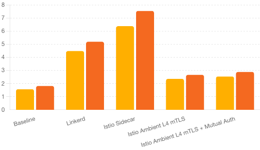

# Introduction

Service meshes provide essential capabilities for managing microservices traffic, including security, observability, and traffic management. However, these features often come with performance trade-offs. This project explores the performance impact of different service mesh configurations. Specifically, we will compare [Istio](https://istio.io/) ambient mode. Ambient mode is a newer approach designed to reduce the overhead associated with the sidecar pattern.

## Test Environment

A two node [EKS](https://aws.amazon.com/eks/) Kubernetes cluster was used as the test environment. The nodes were deployed in the same availability zone to reduce latency variations during testing. The m7i.2xlarge instance type was used to provide a balance of compute, memory and networking resources. Refer to the AWS EC2 [instance-types](https://aws.amazon.com/ec2/instance-types/) for additional details.

To generate consistent and realistic load, [Nighthawk](https://github.com/envoyproxy/nighthawk) is used as the load generator with the following configuration:

* Nighthawk-http-server & Nighthawk client were deployed on separate nodes.
* Load Rate: 160, 1,600, and 16,000 Requests Per Second (RPS).
* [TODO] Add configured resource requests and limits.

## Test Configuration

Three different Istio Ambient mode configuration were tested:

*mTLS only: mTLS between ztunnel node proxies.
*mTLS with L4 auth policy: A layer 4 [authorization policy]() is added to control access between nighthawk client and server workload based on identities.
*mTLS with L7 auth policy: A layer 7 authorization policy is added to control access between nighthawk client and server workload based on Layer 7 connection attributes, e.g.s HTTP methods.

## Test Results

**160 RPS Nighthawk Configuration:** `Time=60s, Requests Per Second=10, Concurrent Connections=10, Concurrency=16, Number of Runs=5`

| Configuration  | 50th Percentile Latency | 75th Percentile Latency | 95th Percentile Latency | 99th Percentile Latency |
| -------------- | ----------------------- | ----------------------- | ----------------------- | ----------------------- |
| Baseline       | 0.455 ms                | 0.511 ms                | 0.578 ms                | 0.661 ms                |
| mTLS Only      | 0.742 ms                | 0.864 ms                | 1.017 ms                | 1.154 ms                |
| mTLS + L4 Auth | 0.738 ms                | 0.860 ms                | 1.012 ms                | 1.131 ms                |
| mTLS + L7 Auth | 1.273 ms                | 1.537 ms                | 1.873 ms                | 2.089 ms                |

Below is a graph summarizing the latency impacts for this configuration:

[TODO] Update image based on test results.



**1,600 RPS Nighthawk Configuration:** `Time=60s, Requests Per Second=100, Concurrent Connections=10, Concurrency=16, Number of Runs=5`

| Configuration  | 50th Percentile Latency | 75th Percentile Latency | 95th Percentile Latency | 99th Percentile Latency |
| -------------- | ----------------------- | ----------------------- | ----------------------- | ----------------------- |
| Baseline       | 0.421 ms                | 0.485 ms                | 0.555 ms                | 0.635 ms                |
| mTLS Only      | 0.406 ms                | 0.599 ms                | 0.874 ms                | 1.034 ms                |
| mTLS + L4 Auth | 0.392 ms                | 0.576 ms                | 0.863 ms                | 1.029 ms                |
| mTLS + L7 Auth | 0.511 ms                | 0.876 ms                | 1.247 ms                | 1.592 ms                |

Below is a graph summarizing the latency impacts for this configuration:

[TODO] Update image based on test results.


**16,000 RPS Nighthawk Configuration:** `Time=60s, Requests Per Second=1000, Concurrent Connections=10, Concurrency=16, Number of Runs=5`

| Configuration  | 50th Percentile Latency | 75th Percentile Latency | 95th Percentile Latency | 99th Percentile Latency |
| -------------- | ----------------------- | ----------------------- | ----------------------- | ----------------------- |
| Baseline       | 0.180 ms                | 0.336 ms                | 0.523 ms                | 0.664 ms                |
| mTLS Only      | 0.245 ms                | 0.280 ms                | 0.352 ms                | 0.509 ms                |
| mTLS + L4 Auth | 0.245 ms                | 0.280 ms                | 0.347 ms                | 0.487 ms                |
| mTLS + L7 Auth | 0.522 ms                | 0.595 ms                | 0.744 ms                | 1.000 ms                |

Below is a graph summarizing the latency impacts for this configuration:

[TODO] Update image based on test results.


__Notes:__

* Due to the dynamic nature of the cloud computing environments results may vary, but relative percentages should be consistent with the provided results.
* The mTLS + L7 test @ 16,000 rps uses __sandwich__ with the following resources:

  ```sh
  resources:
    limits:
      cpu: "2"
      memory: 1Gi
    requests:
      cpu: 500m
      memory: 128Mi
  ```

## Reproducer Steps

Create the EKS cluster using [eksctl](https://eksctl.io/):

```sh
eksctl create cluster -f - <<EOF
apiVersion: eksctl.io/v1alpha5
kind: ClusterConfig
metadata:
  name: my-test-cluster
  region: us-west-2
availabilityZones:
- us-west-2a
- us-west-2b
managedNodeGroups:
- name: ng-1
  desiredCapacity: 2
  instanceType: m7i.2xlarge
  ssh:
    allow: true
  availabilityZones:
  - us-west-2a
EOF
```

Run the Nighthawk workloads:

```sh
kubectl apply -f - <<EOF
apiVersion: v1
kind: Service
metadata:
  name: server
  labels:
    app: server
    service: server
spec:
  ports:
  - port: 9080
    name: http
  selector:
    app: server
---
kind: ConfigMap
apiVersion: v1
metadata:
  name: server
data:
  config.yaml: |-
    static_resources:
      listeners:
        - address:
            socket_address:
              address: 0.0.0.0
              port_value: 9080
          filter_chains:
            - filters:
                - name: envoy.filters.network.http_connection_manager
                  typed_config:
                    "@type": type.googleapis.com/envoy.extensions.filters.network.http_connection_manager.v3.HttpConnectionManager
                    generate_request_id: false
                    codec_type: AUTO
                    stat_prefix: ingress_http
                    route_config:
                      name: local_route
                      virtual_hosts:
                        - name: service
                          domains:
                            - "*"
                    http_filters:
                      - name: dynamic-delay
                        typed_config:
                          "@type": type.googleapis.com/nighthawk.server.ResponseOptions
                      - name: nighthawk-server
                        typed_config:
                          "@type": type.googleapis.com/nighthawk.server.ResponseOptions
                          response_body_size: 10
                          v3_response_headers:
                            - { header: { key: "foo", value: "bar" } }
                            - {
                                header: { key: "foo", value: "bar2" },
                                append: true,
                              }
                            - { header: { key: "x-nh", value: "1" } }
                      - name: envoy.filters.http.router
                        typed_config:
                          "@type": type.googleapis.com/envoy.extensions.filters.http.router.v3.Router
                          dynamic_stats: false
    admin:
      access_log_path: /tmp/envoy.log
      address:
        socket_address:
          address: 0.0.0.0
          port_value: 9081
---
apiVersion: v1
kind: ServiceAccount
metadata:
  name: server
  labels:
    app: server
---
apiVersion: apps/v1
kind: Deployment
metadata:
  name: server
  labels:
    app: server
spec:
  replicas: 1
  selector:
    matchLabels:
      app: server
  template:
    metadata:
      labels:
        app: server
    spec:
      containers:
      - name: server
        image: envoyproxy/nighthawk-dev:latest
        imagePullPolicy: IfNotPresent
        command: ["nighthawk_test_server","-c", "/tmp/config/config.yaml"]
        ports:
        - containerPort: 9080
        volumeMounts:
        - name: config-volume
          mountPath: /tmp/config
        - name: tmp
          mountPath: /tmp
        securityContext:
          runAsUser: 1000
      serviceAccount: server
      affinity:
        nodeAffinity:
          requiredDuringSchedulingIgnoredDuringExecution:
            nodeSelectorTerms:
            - matchExpressions:
              - key: app
                operator: NotIn
                values:
                - client
      volumes:
      - name: config-volume
        configMap:
          name: server-config
      - name: tmp
        emptyDir: {}
---
apiVersion: v1
kind: ServiceAccount
metadata:
  name: client
  labels:
    app: client
---
apiVersion: apps/v1
kind: Deployment
metadata:
  name: client
  labels:
    app: client
spec:
  replicas: 1
  selector:
    matchLabels:
      app: client
  template:
    metadata:
      labels:
        app: client
    spec:
      containers:
      - name: nighthawk
        image: envoyproxy/nighthawk-dev:latest
        imagePullPolicy: IfNotPresent
        command: ["/bin/ash", "-c", "sleep 10000000"]
        securityContext:
          runAsUser: 1000
      affinity:
        nodeAffinity:
          requiredDuringSchedulingIgnoredDuringExecution:
            nodeSelectorTerms:
            - matchExpressions:
              - key: app
                operator: In
                values:
                - client
      serviceAccount: client
EOF
```

Verify connectivity between the workloads:

```sh
kubectl exec $(kubectl get pods -l app=client -o custom-columns=:.metadata.name --no-headers) -c nighthawk -- nighthawk_client --duration 5 --simple-warmup --rps 1000 --connections 1 --concurrency auto -v error http://server:9080/
```

## Run Tests

### Baseline Test

Before installing Istio, create a baseline by running the following tests:

Run the 160 rps test:

```sh
kubectl exec $(kubectl get pods -l app=client -o custom-columns=:.metadata.name --no-headers) -c nighthawk -- nighthawk_client --duration 60 --rps 10 --connections 10 --concurrency 16 -v info http://server:9080/ | sleep 120
```

Run the 1,600 rps test:

```sh
kubectl exec $(kubectl get pods -l app=client -o custom-columns=:.metadata.name --no-headers) -c nighthawk -- nighthawk_client --duration 60 --rps 100 --connections 10 --concurrency 16 -v info http://server:9080/ | sleep 120
```

Run the 16,000 rps test:

```sh
kubectl exec $(kubectl get pods -l app=client -o custom-columns=:.metadata.name --no-headers) -c nighthawk -- nighthawk_client --duration 60 --rps 1000 --connections 10 --concurrency 16 -v info http://server:9080/ | sleep 120
```

### Ambient mTLS Test

Install Istio:

```sh

```

Label the default namespace:

```sh

```

The default namespace is now secured using mTLS. Rerun the same tests from the baseline test section.

### Ambient L4 Authorization Policy Test

Create a L4 auth policy that allows the client to call the server:

```sh
kubectl apply -f - <<EOF
apiVersion: security.istio.io/v1beta1
kind: AuthorizationPolicy
metadata:
  name: test
spec:
  selector:
    matchLabels:
      app: server
  action: ALLOW
  rules:
  - from:
    - source:
        principals:
        - cluster.local/ns/default/sa/client
EOF
```

Rerun the same tests from the baseline test section.

### Ambient L7 Authorization Policy Test

Create a waypoint:

```sh

```

[TODO] Automate the sandwich waypoint.

Adjust the cpu/mem resources (if needed).

Label the client and server services to use the waypoint:

```sh
kubectl label svc/client istio.io/use-waypoint=static-waypoint --overwrite
kubectl label svc/server istio.io/use-waypoint=static-waypoint --overwrite
```

Rerun the same tests from the baseline test section.

## Conclusion

Choosing the right service mesh configuration depends on your specific needs and performance requirements. Ambient mode shows promising results, significantly reducing the latency overhead compared to traditional sidecar deployments. However, for comprehensive L4/L7 features, the sidecar mode is still relevant despite the higher latency.

For detailed test configurations and additional insights, please visit our [GitHub repository](https://github.com/solo-io/service-mesh-for-less-blog/tree/main).
